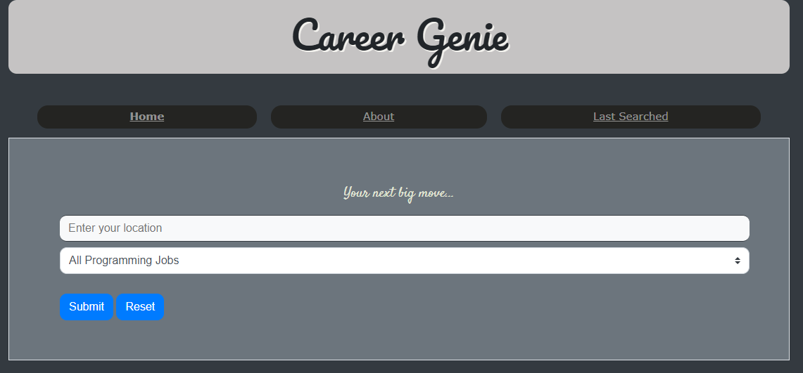

# The Career Genie

## Description

This application helps users look for jobs that are listed on Github in a specific location.

## Elevator Pitch

Your Fetch is my command.  
Welcome to Career Genie.  
Often times job search engines return numerous results,  
many of which are not specific to the search queries.  
As developers, We decided to solve this problem for developers by developing a service  
 that only looks for programming jobs in a specified location and can be filtered by a programming language.  
Given there are many one-stop shops around often selling everything, we decided it would be better to sell you  
one thing, and work on improving it beyond perfection while doing so.  
We're an upcoming team from Sydney made of highly motivated  
very adaptable goal-oriented people who put the end user first.

## Link to the Deployed Application

[The Career Genie](https://forester93.github.io/job-genie/)

## Link to the Github Repository

[The Career Genie Github Repo](https://github.com/Forester93/job-genie/)

## Powerpoint Slides Link

[The Career Genie Project Presentation](https://prezi.com/p/mzpondrwgaru/career-genie/)

## Screenshot of the Application

## The Team

| Name            | GitHub Username | Email                    |
| --------------- | --------------- | ------------------------ |
| Mark Forester   | forester93      | markforester93@gmail.com |
| Diana Koeswanto | dianakoeswanto  | N/A                      |
| Jin Hong        | jhong1016       | N/A                      |
| Sandeep GC      | sgc1992         | N/A                      |

## User Story

As a user,  
I want to search for a software job at a particular location  
So that I can get my dream job

## Acceptance Criteria

Given an application with a location textfield and selection of programming languages  
And I have entered a location  
And I have selected "All Programming Jobs"  
When I click Submit  
Then I am taken to a results page  
And I will see a list of jobs available in that location

Given the application has loaded  
And I have previously made a search  
When I navigate to "Last Searched"  
Then I am presented with my last searched results

Given the application has loaded  
But I have not previously made a search  
When I navigate to "Last Searched"  
Then I am presented with a message that no saved searches are found  
And that I am redirected to the homepage

Given that the application has loaded  
When I navigate to "About"  
Then I am presented with information about the application  
And information about team members
